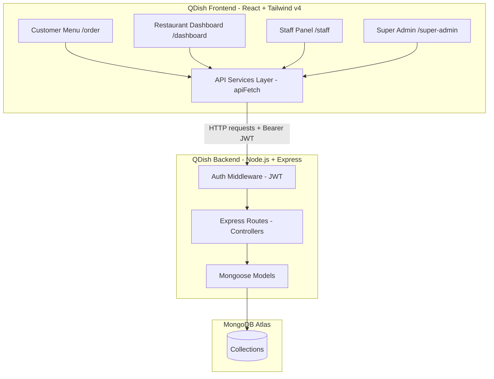

# Thiết kế Hệ thống (design.md)

Tài liệu này mô tả chi tiết kiến trúc, luồng dữ liệu, cập nhật Schema/API Contract, State Management và chiến lược di chuyển dữ liệu của **QDish**.

---

## 1. Kiến trúc Hệ thống

Hệ thống được tổ chức theo mô hình Client-Server 3 lớp truyền thống:



---

## 2. Luồng Dữ liệu (Data Flow)

### 2.1. Đăng nhập & Xác thực
1.  Người dùng điền email/username và mật khẩu tại `Login.tsx`.
2.  FE gọi `POST /api/auth/login`.
3.  BE xác thực tài khoản, tạo mã JWT chứa thông tin: `{ sub: userId, role, restaurantId }` và trả về cho FE.
4.  FE lưu JWT vào `LocalStorage` dưới khóa `qr_food_order_token`.
5.  `App.tsx` sử dụng hook `useAuth` để phân giải mã JWT, lưu trữ state người dùng hiện tại và thực hiện điều hướng theo quyền truy cập (`ProtectedRoute`).
6.  Tất cả các request tiếp theo được đính kèm tự động header `Authorization: Bearer <token>` thông qua fetch client `apiFetch`.

### 2.2. Khách hàng Quét QR & Đặt món (Customer Order Flow)
1.  Khách hàng quét mã QR tại bàn, trình duyệt mở link: `http://qdish.com/order?r={restaurantId}&t={tableNumber}`.
2.  FE gọi API `GET /api/menu?restaurantId={restaurantId}` để lấy thực đơn và `GET /api/categories?restaurantId={restaurantId}` để lấy danh mục.
3.  Nếu khách hàng thiết lập **Hồ sơ sức khỏe** (Goals, Allergies, Preferences):
    *   Hồ sơ được lưu cục bộ tại `LocalStorage`.
    *   FE chạy bộ lọc so khớp: Món ăn chứa allergen của khách sẽ bị khóa nút "Thêm vào giỏ" và viền đỏ cảnh báo. Món ăn phù hợp với Goals & Preferences sẽ được gắn badge "QDish Recommended".
4.  Khách hàng chọn món, điền Tên và Ghi chú bếp, bấm xác nhận.
5.  FE gọi `POST /api/orders` với body: `{ restaurantId, tableNumber, items, note, customerName }`.
6.  BE lưu đơn hàng mới vào MongoDB ở trạng thái `PENDING`, gửi email thông báo cho chủ nhà hàng, và trả thông tin đơn hàng về FE.
7.  FE lưu thông tin đơn hàng và hiển thị Drawer **Theo dõi đơn hàng & Gọi thêm**.
8.  FE thực hiện polling sau mỗi 5-10 giây: `GET /api/orders?restaurantId={rId}&tableNumber={tId}` để đồng bộ trạng thái đơn hàng thời gian thực từ database.

### 2.3. Đầu bếp / Nhân viên Bếp Xử lý đơn (Staff Operations Flow)
1.  Nhân viên bếp đăng nhập tài khoản vai trò `STAFF`, hệ thống chuyển hướng đến `/staff`.
2.  Trang `/staff` thực hiện polling sau mỗi 5 giây gọi API `GET /api/staff/orders` lấy danh sách đơn của nhà hàng mình.
3.  Nhân viên bếp chuẩn bị món xong, bấm nút "Xác nhận ra món".
4.  FE gọi API `PATCH /api/staff/orders/:id` gửi body `{ status: "SERVED" }`.
5.  BE cập nhật trạng thái đơn hàng trong database, ghi nhận nhân viên thực hiện.
6.  Phía khách hàng, polling nhận diện đơn hàng chuyển sang `SERVED`, cập nhật giao diện thông báo món ăn đã được phục vụ lên bàn.

---

## 3. Nâng cấp Mongoose Schema (Backend)

Để lưu trữ các trường QDish, Schema `MenuItemSchema` trong `src/models/MenuItem.ts` được mở rộng như sau:

```typescript
const MenuItemSchema = new Schema<IMenuItem>(
  {
    restaurantId: { type: Schema.Types.ObjectId, ref: "Restaurant", required: true, index: true },
    name: { type: String, required: true, trim: true },
    description: { type: String, trim: true, default: "" },
    price: { type: Number, required: true, min: 0 },
    category: { type: String, required: true, trim: true },
    categoryId: { type: Schema.Types.ObjectId, ref: "Category", required: false },
    imageUrl: { type: String, trim: true, default: "" },
    available: { type: Boolean, default: true },
    
    // Nutrition fields
    calories: { type: Number, default: 0, min: 0 },
    protein: { type: Number, default: 0, min: 0 },
    carbs: { type: Number, default: 0, min: 0 },
    fat: { type: Number, default: 0, min: 0 },
    fiber: { type: Number, default: 0, min: 0 },
    sugar: { type: Number, default: 0, min: 0 },
    sodium: { type: Number, default: 0, min: 0 },
    nutritionScore: { type: Number, default: 0, min: 0 },
    
    // Allergens
    allergens: { type: [String], default: [] },
    
    // Health Labels
    healthTags: { type: [String], default: [] },
    healthLabels: { type: [String], default: [] }
  },
  { timestamps: true }
);
```

---

## 4. API Contracts cập nhật

### 4.1. Thực đơn (Menu API)
*   **Tạo món mới:** `POST /api/menu`
    *   *Request Body:*
        ```json
        {
          "name": "Bánh mì ức gà áp chảo",
          "description": "Ức gà áp chảo nguyên cám",
          "price": 45000,
          "category": "Healthy Bread",
          "categoryId": "64724a87a71f01c87ccca821",
          "imageUrl": "https://images.unsplash.com/...",
          "available": true,
          "calories": 350,
          "protein": 28,
          "carbs": 45,
          "fat": 8,
          "fiber": 4,
          "sugar": 2,
          "sodium": 320,
          "nutritionScore": 85,
          "allergens": ["GLUTEN"],
          "healthLabels": ["HIGH_PROTEIN", "LOW_FAT"]
        }
        ```
*   **Cập nhật món:** `PATCH /api/menu/:id` (Chấp nhận cập nhật từng phần các trường trên).

### 4.2. Danh mục (Category API)
*   **Cập nhật danh mục:** `PATCH /api/categories/:id`
    *   BE tự động cập nhật lại trường string `category` trong các `MenuItem` có `categoryId` tương ứng để tránh dữ liệu không đồng nhất.

### 4.3. Đặt món không bị chặn (Order API)
*   **Sửa đổi logic `POST /api/orders`:**
    BE sẽ không chặn đặt đơn mới nếu bàn ăn đang có đơn hoạt động. BE chỉ kiểm tra sự tồn tại của nhà hàng và bàn ăn hợp lệ. Khách hàng có thể đặt nhiều đơn hàng kế tiếp nhau, các đơn hàng này sẽ được gộp chung theo `tableNumber` và hiển thị trên màn hình chế biến của staff.

---

## 5. State Management phía Client

*   **Auth State:** Được quản lý tập trung qua `useAuth` hook. Token JWT được phân rã để lưu trữ vai trò người dùng (`Role`), ID người dùng (`id`), và ID nhà hàng (`restaurantId`).
*   **Cart State:** Được quản lý thông qua hook `useCart`. Giỏ hàng của từng nhà hàng được lưu trữ riêng biệt tại `LocalStorage` theo khóa `qdish_cart_{restaurantId}` để tránh xung đột dữ liệu khi khách hàng ăn ở nhiều quán khác nhau.
*   **Health Profile State:** Được quản lý bởi hook `useHealthProfile`, lưu trữ thông tin chỉ số thể trạng và dị ứng của khách hàng trong `LocalStorage` dưới khóa `qdish_health_profile`.

---

## 6. Chiến lược Responsive & UI State

*   **Mobile-first:** Menu khách hàng và bảng điều khiển bếp (Staff Dashboard) được tối ưu hoàn toàn cho màn hình di động (Portrait mode). Sử dụng Tailwind flex, grid, drawer trượt dưới lên (Shadcn Sheet), các nút bấm có vùng chạm lớn (chiều cao tối thiểu 44px).
*   **Loading & Skeleton:** Sử dụng component `Skeleton` của Shadcn để mô phỏng bố cục dữ liệu đang tải, tạo cảm giác tải trang mượt mà hơn.
*   **Toast Alert:** Tích hợp bộ thư viện Toast `Sonner` nằm ở vị trí dễ nhìn để thông báo trực quan thành công, thất bại, cảnh báo.
*   **Confirm Modal:** Các thao tác xóa, hủy, thay đổi tài khoản ngân hàng nhận tiền đều yêu cầu xác thực qua Modal Dialog.

---

## 7. Các bước gỡ bỏ Mock Data an toàn
1.  **Bước 1:** Bổ sung các trường QDish vào schema `MenuItem` của Backend và khởi động lại Server.
2.  **Bước 2:** Cập nhật các service API trong Frontend (`authService`, `menuService`, `orderService`, `restaurantService`) để kết nối chính xác với API thật của BE.
3.  **Bước 3:** Thay thế mock data trong các trang chính:
    *   Thay thế mock restaurants và mock menu trong `CustomerMenu.tsx`.
    *   Thay thế logic login/forgot password bằng API thực tế.
4.  **Bước 4:** Xây dựng Dashboard chủ quán, Staff, Super Admin bằng cách kéo dữ liệu trực tiếp từ các service API vừa nâng cấp.
5.  **Bước 5:** Xóa bỏ file `mockData.ts` và kiểm tra lại toàn bộ ứng dụng để đảm bảo không còn import lỗi.
